# BÁO CÁO ĐỒ ÁN MÔN HỌC: WEBSITE QUẢN LÝ TRUNG TÂM TIỆC CƯỚI

## 1. GIỚI THIỆU ĐỀ TÀI

### 1.1. Tổng quan
Dự án xây dựng một hệ thống website toàn diện cho Trung tâm Tiệc cưới, phục vụ hai đối tượng chính: khách hàng (người dùng cuối) và ban quản lý (Admin/Staff). Hệ thống nhằm mục đích số hóa quy trình quảng bá dịch vụ, đặt lịch và quản lý vận hành trung tâm tiệc cưới.

### 1.2. Mục tiêu dự án
*   **Đối với khách hàng:** Cung cấp thông tin trực quan về không gian sảnh, thực đơn, các gói dịch vụ. Cho phép khách hàng tìm hiểu, ước tính chi phí và gửi yêu cầu đặt lịch trực tuyến một cách thuận tiện.
*   **Đối với quản trị viên:** Cung cấp công cụ quản lý chuyên nghiệp để theo dõi lịch đặt, xử lý thông tin liên hệ, cập nhật nội dung website (thực đơn, sảnh cưới, tin tức) và báo cáo thống kê doanh thu/hoạt động.

---

## 2. PHÂN TÍCH VÀ THIẾT KẾ HỆ THỐNG

### 2.1. Yêu cầu chức năng
#### Phân hệ Khách hàng (Public Site)
*   **Trang chủ:** Giới thiệu tổng quan, banner sự kiện, các dịch vụ nổi bật.
*   **Giới thiệu & Dịch vụ:** Thông tin chi tiết về trung tâm, các gói dịch vụ cưới hỏi, sự kiện.
*   **Sảnh tiệc & Thực đơn:** Xem danh sách, chi tiết sảnh cưới (sức chứa, hình ảnh) và thực đơn (món ăn, giá cả).
*   **Đặt lịch (Booking):** Form đăng ký tiệc trực tuyến (chọn ngày, sảnh, số lượng khách, ngân sách, ghi chú).
*   **Liên hệ & Tư vấn:** Form gửi câu hỏi, yêu cầu tư vấn nhanh.
*   **Thư viện Media:** Xem album ảnh, video hoạt động thực tế.

#### Phân hệ Quản trị (Admin Dashboard)
*   **Xác thực:** Đăng nhập bảo mật (JWT Authentication).
*   **Dashboard:** Thống kê tổng quan số lượng booking, trạng thái xử lý, doanh thu dự kiến.
*   **Quản lý Booking:** Danh sách đơn đặt, bộ lọc trạng thái (Pending/Confirmed/Cancelled), chi tiết yêu cầu, duyệt/hủy đơn.
*   **Quản lý Liên hệ (Contacts):** Theo dõi phản hồi khách hàng, đánh dấu trạng thái xử lý.
*   **Quản lý Nội dung (CMS):** Thêm/Sửa/Xóa thông tin Sảnh cưới, Thực đơn, Khuyến mãi, Album ảnh.

### 2.2. Chi tiết Công nghệ & Lý do lựa chọn
Hệ thống được xây dựng trên nền tảng các công nghệ mạnh mẽ và phổ biến nhất hiện nay, đảm bảo tính ổn định và khả năng bảo trì lâu dài:

1.  **Spring Boot (Backend Framework):**
    *   **Lý do chọn:** Cung cấp khả năng phát triển nhanh (RAD), cấu hình tự động (Auto Configuration) và hệ sinh thái thư viện khổng lồ.
    *   **Ứng dụng:** Xử lý logic nghiệp vụ, RESTful API, quản lý bảo mật với Spring Security.
2.  **MySQL (Database):**
    *   **Lý do chọn:** Hệ quản trị cơ sở dữ liệu quan hệ phổ biến, miễn phí, hỗ trợ tốt các giao dịch phức tạp (ACID) cần thiết cho booking.
    *   **Ứng dụng:** Lưu trữ bền vững dữ liệu người dùng, đơn hàng, danh mục.
3.  **Hibernate / Spring Data JPA (ORM):**
    *   **Lý do chọn:** Tăng tốc độ phát triển bằng cách ánh xạ object-table, giảm thiểu việc viết query SQL thủ công dễ gây lỗi.
4.  **Thymeleaf (Template Engine):**
    *   **Lý do chọn:** Tích hợp sâu với Spring, cho phép render giao diện ngay phía server (SSR), tốt cho SEO ban đầu so với SPA thuần túy.
5.  **JWT (JSON Web Token):**
    *   **Lý do chọn:** Chuẩn xác thực hiện đại, stateless (không lưu session trên server), giúp hệ thống dễ dàng mở rộng (scale) sau này.

### 2.3. Thiết kế Hệ thống Chi tiết
#### 2.3.1. Biểu đồ Use Case (Use Case Diagram)
Hệ thống được chia thành 2 nhóm tác nhân chính với các chức năng cụ thể:

*   **Khách hàng (Guest/User):**
    *   **Tìm kiếm & Tra cứu:** Xem danh sách sảnh cưới, thực đơn, album ảnh.
    *   **Đặt lịch (Booking):** Đăng ký thông tin đặt tiệc, nhận báo giá sơ bộ.
    *   **Liên hệ:** Gửi phản hồi hoặc yêu cầu tư vấn.
*   **Quản trị viên (Admin/Staff):**
    *   **Quản lý hệ thống:** Đăng nhập, quản lý tài khoản nhân viên.
    *   **Quản lý kinh doanh:** Duyệt đơn đặt tiệc, quản lý danh sách sảnh, thực đơn.
    *   **Thống kê:** Xem báo cáo doanh thu, hiệu suất hoạt động.

**Giải thích biểu đồ Use Case:**
| Thành phần | Mô tả |
|------------|-------|
| **Actor (Tác nhân)** | Đại diện cho người dùng tương tác với hệ thống: Khách hàng (Guest) và Quản trị viên (Admin/Staff) |
| **Use Case (Trường hợp sử dụng)** | Các hình elip thể hiện chức năng mà hệ thống cung cấp cho tác nhân |
| **Association (Liên kết)** | Đường nối giữa tác nhân và use case cho thấy tác nhân có thể thực hiện chức năng đó |
| **Include** | Quan hệ bao gồm - một use case bắt buộc phải gọi use case khác (VD: Đặt tiệc bao gồm Xem sảnh) |
| **Extend** | Quan hệ mở rộng - use case có thể được mở rộng tùy điều kiện (VD: Thanh toán mở rộng từ Đặt tiệc) |

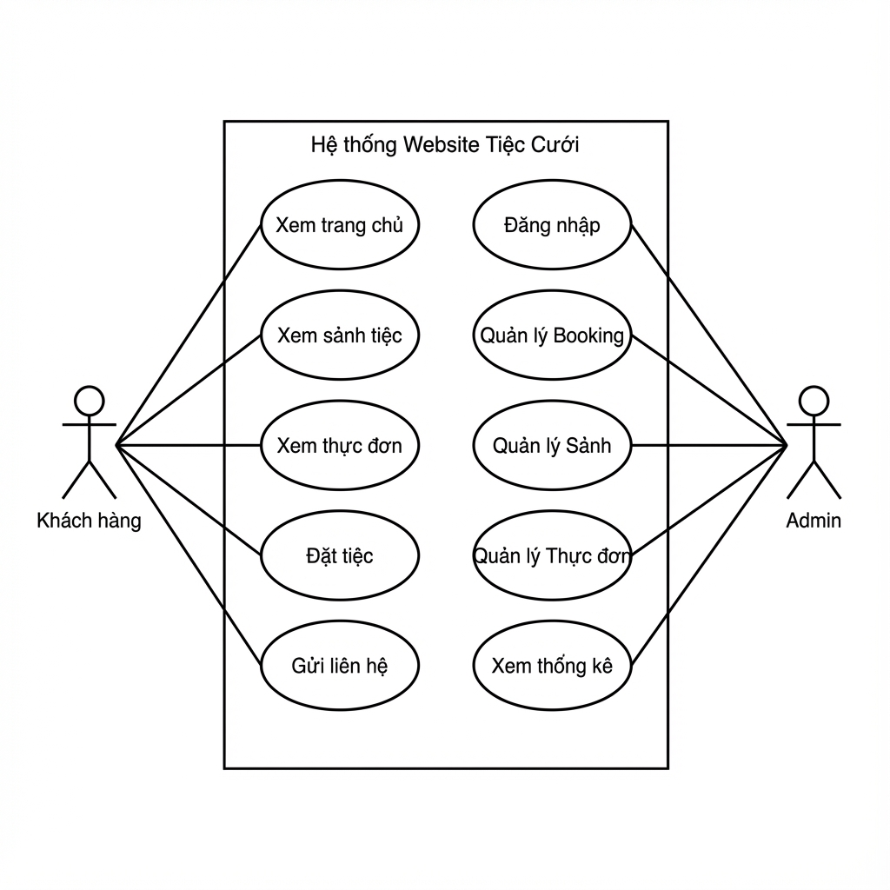

#### 2.3.2. Thiết kế Cơ sở dữ liệu (ERD Model)
Mô hình Quan hệ Thực thể (Entity Relationship Diagram) được thiết kế chuẩn hóa để đảm bảo tính toàn vẹn dữ liệu:

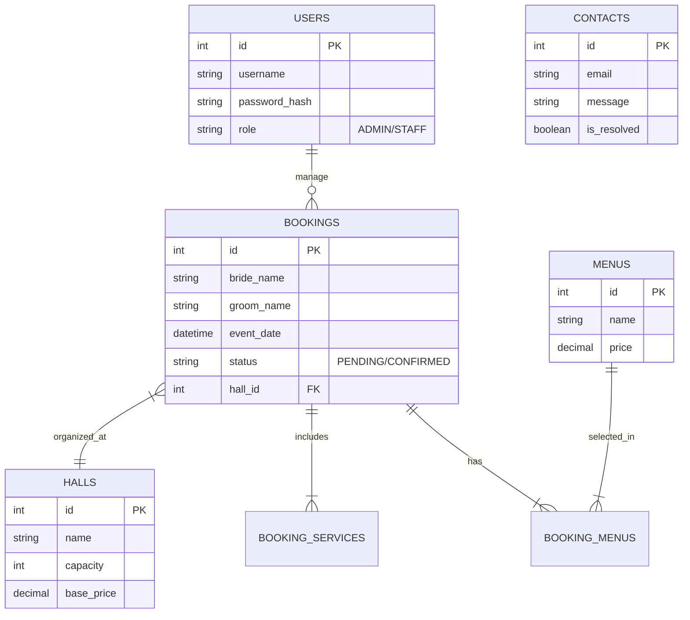
```mermaid
erDiagram
    USERS ||--o{ BOOKINGS : "manage"
    BOOKINGS }|--|| HALLS : "organized_at"
    BOOKINGS ||--|{ BOOKING_SERVICES : "includes"
    MENUS ||--|{ BOOKING_MENUS : "selected_in"
    BOOKINGS ||--|{ BOOKING_MENUS : "has"
    
    USERS {
        int id PK
        string username
        string password_hash
        string role "ADMIN/STAFF"
    }

    HALLS {
        int id PK
        string name
        int capacity
        decimal base_price
    }

    BOOKINGS {
        int id PK
        string bride_name
        string groom_name
        datetime event_date
        string status "PENDING/CONFIRMED"
        int hall_id FK
    }

    MENUS {
        int id PK
        string name
        decimal price
    }
    
    CONTACTS {
        int id PK
        string email
        string message
        boolean is_resolved
    }
```

**Giải thích ký hiệu quan hệ trong ERD:**
| Ký hiệu | Ý nghĩa | Ví dụ trong hệ thống |
|---------|---------|----------------------|
| `\|\|--o{` | Một-Nhiều (One-to-Many) | 1 User quản lý nhiều Bookings |
| `}\|--\|\|` | Nhiều-Một (Many-to-One) | Nhiều Bookings được tổ chức tại 1 Hall |
| `\|\|--\|{` | Một-Nhiều bắt buộc | 1 Booking phải có ít nhất 1 Booking_Service |
| **PK** | Primary Key - Khóa chính | Định danh duy nhất cho mỗi bản ghi |
| **FK** | Foreign Key - Khóa ngoại | Liên kết đến bảng khác (hall_id trong Bookings) |

**Mô tả mối quan hệ:**
- **USERS → BOOKINGS:** Nhân viên/Admin quản lý và xử lý các đơn đặt tiệc
- **BOOKINGS → HALLS:** Mỗi đơn đặt tiệc được tổ chức tại một sảnh cụ thể
- **BOOKINGS → BOOKING_SERVICES:** Đơn đặt tiệc bao gồm nhiều dịch vụ đi kèm
- **MENUS → BOOKING_MENUS:** Thực đơn được chọn trong các đơn đặt tiệc

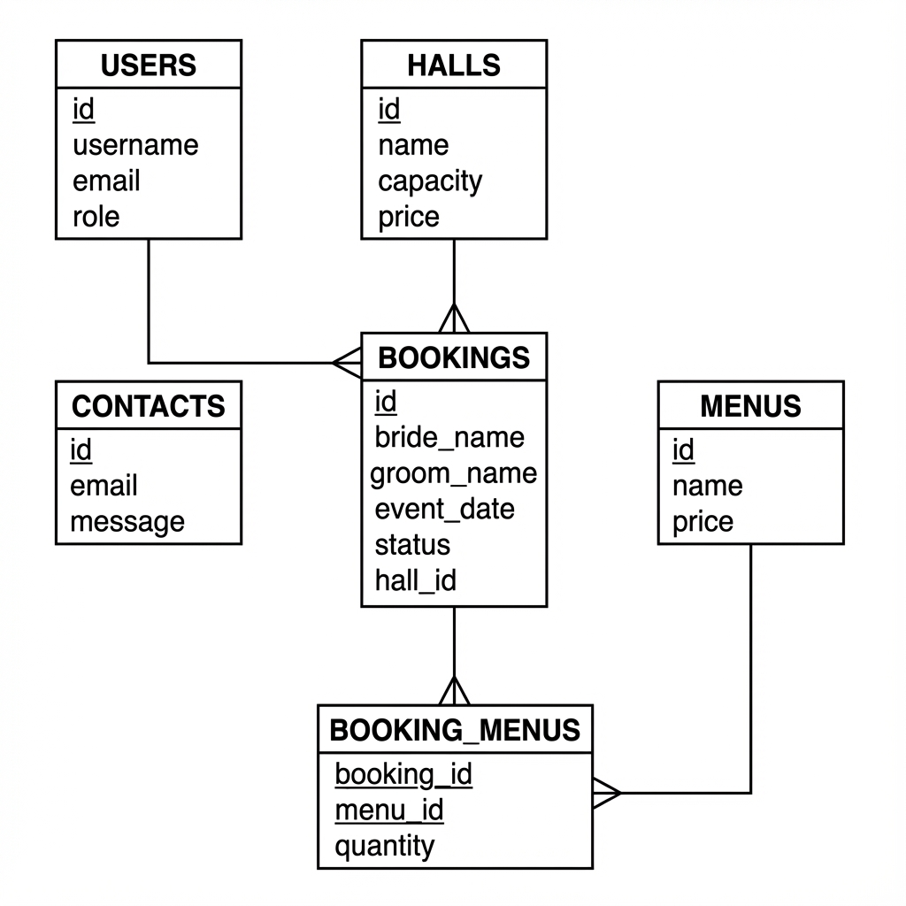

#### 2.3.3. Mô tả các thực thể chính
*   **USERS:** Quản lý thông tin đăng nhập và phân quyền (RBAC).
*   **HALLS:** Lưu trữ thông tin cơ sở vật chất (Sảnh cưới), giá sàn, sức chứa tối đa.
*   **BOOKINGS:** Bảng trung tâm lưu trữ toàn bộ thông tin giao dịch đặt tiệc, liên kết chặt chẽ với Sảnh (Halls) và Dịch vụ đi kèm.
*   **MENUS & SERVICES:** Danh mục sản phẩm kinh doanh, có thể mở rộng linh hoạt.

#### 2.3.3.1. Sơ đồ Database Schema Chi tiết (Physical Data Model)
Sơ đồ dưới đây thể hiện cấu trúc vật lý của các bảng trong database với đầy đủ các cột và mối quan hệ khóa ngoại:

```
┌─────────────────────────────────┐       ┌─────────────────────────────────┐
│           USERS                 │       │          EMPLOYEES              │
├─────────────────────────────────┤       ├─────────────────────────────────┤
│ PK  id            BIGINT        │◄──┐   │ PK  id            BIGINT        │
│     username      VARCHAR(100)  │   │   │ FK  user_id       BIGINT        │───┐
│     email         VARCHAR(150)  │   │   │     full_name     VARCHAR(150)  │   │
│     password_hash VARCHAR(255)  │   │   │     phone         VARCHAR(30)   │   │
│     status        VARCHAR(20)   │   │   │     email         VARCHAR(150)  │   │
│     primary_role  VARCHAR(20)   │   │   │     position      VARCHAR(100)  │   │
│     created_at    DATETIME      │   │   │     department    VARCHAR(100)  │   │
│     updated_at    DATETIME      │   │   │     hire_date     DATE          │   │
└─────────────────────────────────┘   │   │     created_at    DATETIME      │   │
         │                            │   │     updated_at    DATETIME      │   │
         │                            │   └─────────────────────────────────┘   │
         │                            └─────────────────────────────────────────┘
         │
         ▼
┌─────────────────────────────────┐       ┌─────────────────────────────────┐
│         CONTACTS                │       │       REFRESH_TOKENS            │
├─────────────────────────────────┤       ├─────────────────────────────────┤
│ PK  id            BIGINT        │       │ PK  id            BIGINT        │
│     full_name     VARCHAR(150)  │       │ FK  user_id       BIGINT        │───► USERS
│     email         VARCHAR(150)  │       │     token         VARCHAR(500)  │
│     phone         VARCHAR(30)   │       │     expires_at    DATETIME      │
│     subject       VARCHAR(200)  │       │     revoked       TINYINT       │
│     message       VARCHAR(1000) │       │     created_at    DATETIME      │
│     flag          VARCHAR(20)   │       └─────────────────────────────────┘
│ FK  assigned_to   BIGINT        │───► USERS
│     resolved_at   DATETIME      │
│     created_at    DATETIME      │
└─────────────────────────────────┘

┌─────────────────────────────────┐       ┌─────────────────────────────────┐
│            HALLS                │       │            MENUS                │
├─────────────────────────────────┤       ├─────────────────────────────────┤
│ PK  id            BIGINT        │◄──┐   │ PK  id            BIGINT        │
│     code          VARCHAR(50)   │   │   │     name          VARCHAR(150)  │
│     name          VARCHAR(150)  │   │   │     price         DECIMAL(15,2) │
│     capacity      INT           │   │   │     description   VARCHAR(500)  │
│     base_price    DECIMAL(15,2) │   │   │     category      VARCHAR(100)  │
│     description   VARCHAR(500)  │   │   │     image_url     VARCHAR(255)  │
│     amenities     JSON          │   │   │     is_featured   TINYINT       │
│     image_url     VARCHAR(255)  │   │   │     type          VARCHAR(50)   │
│     display_order INT           │   │   │     created_at    DATETIME      │
│     is_active     TINYINT       │   │   │     updated_at    DATETIME      │
│     created_at    DATETIME      │   │   └─────────────────────────────────┘
│     updated_at    DATETIME      │   │
└─────────────────────────────────┘   │
                                      │
┌─────────────────────────────────────┴────────────────────────────────────────┐
│                                BOOKINGS                                       │
├──────────────────────────────────────────────────────────────────────────────┤
│ PK  id            BIGINT                                                      │
│     bride_name    VARCHAR(150)     groom_name     VARCHAR(150)               │
│     email         VARCHAR(150)     phone          VARCHAR(30)                │
│     event_date    DATE             time_slot      VARCHAR(50)                │
│ FK  hall_id       BIGINT ──────────────────────────────────────────────► HALLS│
│     guest_count   INT              budget_min     DECIMAL(15,2)              │
│     budget_max    DECIMAL(15,2)    status         VARCHAR(20)                │
│     notes         VARCHAR(500)     flag           VARCHAR(20)                │
│     created_at    DATETIME         updated_at     DATETIME                   │
└──────────────────────────────────────────────────────────────────────────────┘
         │
         │ 1:N
         ▼
┌─────────────────────────────────┐       ┌─────────────────────────────────┐
│      BOOKING_SERVICES           │       │        MEDIA_ALBUMS             │
├─────────────────────────────────┤       ├─────────────────────────────────┤
│ PK  booking_id    BIGINT        │───► BOOKINGS  │ PK  id            BIGINT        │◄──┐
│ PK  service_code  VARCHAR(100)  │       │     title         VARCHAR(200)  │   │
└─────────────────────────────────┘       │     description   VARCHAR(500)  │   │
                                          │     created_at    DATETIME      │   │
┌─────────────────────────────────┐       │     updated_at    DATETIME      │   │
│        PROMOTIONS               │       └─────────────────────────────────┘   │
├─────────────────────────────────┤                                             │
│ PK  id            BIGINT        │       ┌─────────────────────────────────┐   │
│     title         VARCHAR(200)  │       │        MEDIA_ITEMS              │   │
│     slug          VARCHAR(200)  │       ├─────────────────────────────────┤   │
│     description   VARCHAR(1000) │       │ PK  id            BIGINT        │   │
│     start_date    DATE          │       │     title         VARCHAR(200)  │   │
│     end_date      DATE          │       │     type          VARCHAR(20)   │   │
│     terms         VARCHAR(1000) │       │     url           VARCHAR(255)  │   │
│     created_at    DATETIME      │       │     thumbnail_url VARCHAR(255)  │   │
│     updated_at    DATETIME      │       │ FK  album_id      BIGINT        │───┘
└─────────────────────────────────┘       │     display_order INT           │
                                          │     created_at    DATETIME      │
                                          │     updated_at    DATETIME      │
                                          └─────────────────────────────────┘
```

**Giải thích ký hiệu:**
| Ký hiệu | Ý nghĩa |
|---------|---------|
| `PK` | Primary Key - Khóa chính, định danh duy nhất cho mỗi bản ghi |
| `FK` | Foreign Key - Khóa ngoại, tham chiếu đến bảng khác |
| `───►` | Chiều của mối quan hệ khóa ngoại (từ FK đến PK) |
| `◄──` | Bảng được tham chiếu (bảng cha) |
| `1:N` | Quan hệ Một-Nhiều |

**Tổng quan 10 bảng trong hệ thống:**
| STT | Bảng | Chức năng | Quan hệ FK |
|-----|------|-----------|------------|
| 1 | `users` | Quản lý tài khoản đăng nhập | - |
| 2 | `employees` | Thông tin nhân viên | → users |
| 3 | `halls` | Thông tin sảnh tiệc | - |
| 4 | `menus` | Thực đơn món ăn | - |
| 5 | `bookings` | Đơn đặt tiệc | → halls |
| 6 | `booking_services` | Dịch vụ đi kèm booking | → bookings |
| 7 | `contacts` | Yêu cầu liên hệ từ khách | → users |
| 8 | `promotions` | Chương trình khuyến mãi | - |
| 9 | `media_albums` | Album ảnh/video | - |
| 10 | `media_items` | Chi tiết ảnh/video | → media_albums |
| 11 | `refresh_tokens` | Token làm mới phiên đăng nhập | → users |

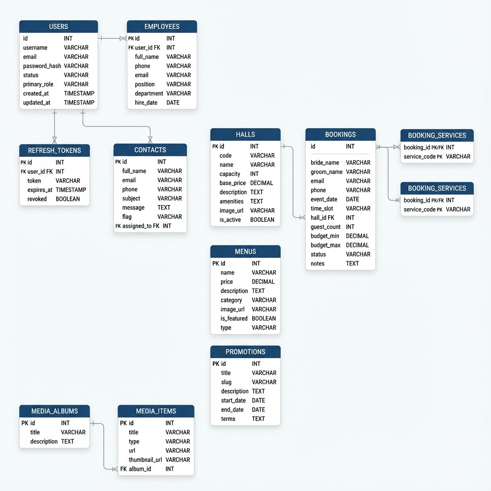

#### 2.3.4. Kiến trúc Hệ thống Tổng quan (High-Level Architecture)
Mô hình kiến trúc phân lớp (Layered Architecture) được áp dụng để đảm bảo sự tách biệt rõ ràng giữa các thành phần:

```mermaid
graph TD
    Client[Client Browser / Mobile] -->|HTTP Request| Controller[Controller Layer (Web/API)]
    
    subgraph "Backend (Spring Boot)"
        Controller -->|DTO| Service[Service Layer (Business Logic)]
        Service -->|Entity| Repo[Repository Layer (Data Access)]
        Repo -->|JPA/Hibernate| DB[(MySQL Database)]
        
        Service -->|SMTP| Email[Email Service]
        Service -->|Upload| Cloud[Cloud Storage]
    end
    
    subgraph "Frontend"
        View[Thymeleaf View] -.->|Render| Client
        JS[JavaScript / AJAX] -.->|API Call| Controller
    end
```

**Mô tả chi tiết các tầng kiến trúc:**
| Tầng | Công nghệ | Chức năng | Trách nhiệm |
|------|-----------|-----------|-------------|
| **Presentation** | Thymeleaf, JS | Giao diện người dùng | Render HTML, xử lý tương tác UI |
| **Controller** | Spring MVC | Điều phối request | Nhận request, validate input, trả response |
| **Service** | Spring Service | Logic nghiệp vụ | Xử lý business rules, orchestration |
| **Repository** | Spring Data JPA | Truy xuất dữ liệu | CRUD operations, query database |
| **Database** | MySQL | Lưu trữ | Persistence, ACID transactions |

**Luồng dữ liệu:** Client → Controller (DTO) → Service (Entity) → Repository → Database

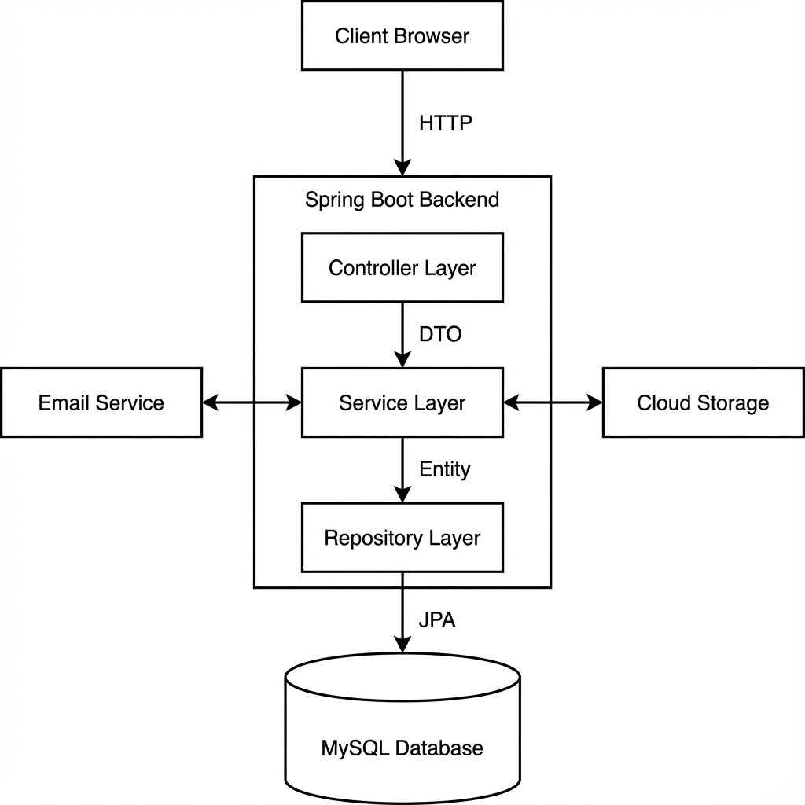

#### 2.3.5. Chi tiết các Quy trình nghiệp vụ (Sequence Diagrams)
Biểu đồ tuần tự (Sequence Diagram) mô tả thứ tự tương tác giữa các đối tượng theo thời gian.

**Giải thích ký hiệu Sequence Diagram:**
| Ký hiệu | Ý nghĩa |
|---------|--------|
| `Actor` | Người dùng tương tác với hệ thống |
| `Participant` | Thành phần hệ thống (Controller, Service, DB) |
| `->>` | Gửi message đồng bộ (chờ phản hồi) |
| `-->>` | Phản hồi/Response trả về |
| `activate/deactivate` | Đánh dấu thời gian xử lý của participant |
| `alt/else` | Rẽ nhánh điều kiện (if-else) |

**a. Quy trình Đặt tiệc (Booking Process)**
*(Luồng quan trọng nhất dành cho khách hàng)*

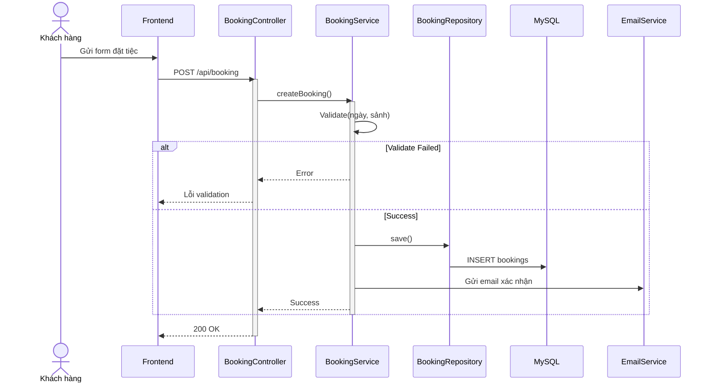
```mermaid
sequenceDiagram
    actor User as Khách hàng
    participant FE as Frontend
    participant Ctrl as BookingController
    participant Svc as BookingService
    participant Repo as BookingRepository
    participant DB as MySQL
    participant Mail as EmailService

    User->>FE: Gửi form đặt tiệc
    FE->>Ctrl: POST /api/booking
    activate Ctrl
    Ctrl->>Svc: createBooking()
    activate Svc
    
    Svc->>Svc: Validate(ngày, sảnh)
    alt Validate Failed
        Svc-->>Ctrl: Error
        Ctrl-->>FE: Lỗi validation
    else Success
        Svc->>Repo: save()
        Repo->>DB: INSERT bookings
        Svc->>Mail: Gửi email xác nhận
        Svc-->>Ctrl: Success
    end
    deactivate Svc
    Ctrl-->>FE: 200 OK
    deactivate Ctrl
```

**Mô tả các bước:**
1. Khách hàng điền và gửi form đặt tiệc trên giao diện
2. Frontend gửi request POST đến BookingController
3. Controller chuyển dữ liệu cho BookingService xử lý
4. Service validate dữ liệu (kiểm tra ngày, sảnh còn trống)
5. Nếu hợp lệ: Lưu vào DB và gửi email xác nhận
6. Nếu lỗi: Trả về thông báo lỗi cho khách

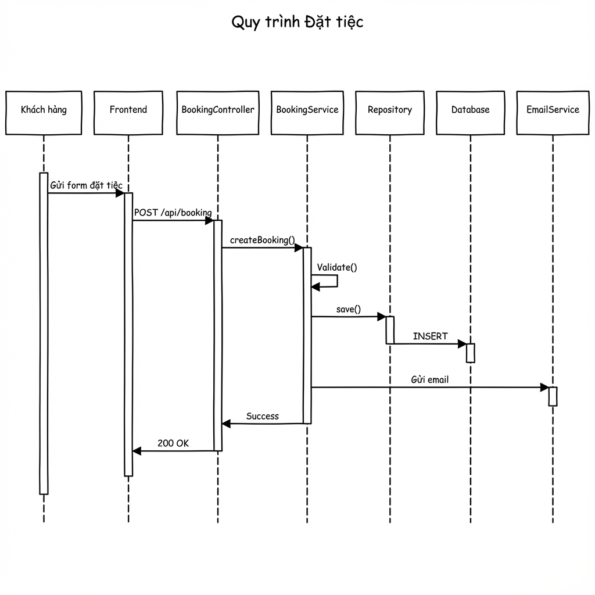

**b. Quy trình Xác thực & Tài khoản (Authentication & Account)**

*   **Đăng ký tài khoản (Registration Flow):**

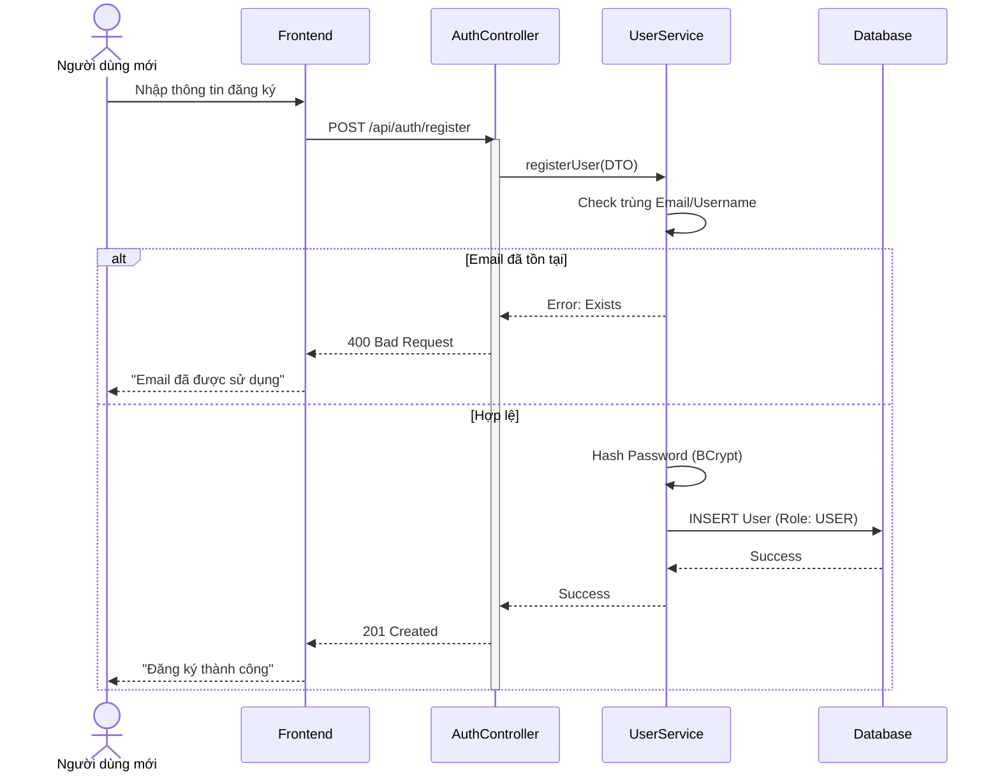
```mermaid
sequenceDiagram
    actor User as Người dùng mới
    participant FE as Frontend
    participant Auth as AuthController
    participant Svc as UserService
    participant DB as Database

    User->>FE: Nhập thông tin đăng ký
    FE->>Auth: POST /api/auth/register
    activate Auth
    Auth->>Svc: registerUser(DTO)
    
    Svc->>Svc: Check trùng Email/Username
    alt Email đã tồn tại
        Svc-->>Auth: Error: Exists
        Auth-->>FE: 400 Bad Request
        FE-->>User: "Email đã được sử dụng"
    else Hợp lệ
        Svc->>Svc: Hash Password (BCrypt)
        Svc->>DB: INSERT User (Role: USER)
        DB-->>Svc: Success
        Svc-->>Auth: Success
        Auth-->>FE: 201 Created
        FE-->>User: "Đăng ký thành công"
    end
    deactivate Auth
```

**Mô tả quy trình:** Người dùng nhập thông tin → Hệ thống kiểm tra email trùng → Mã hóa mật khẩu (BCrypt) → Lưu vào CSDL → Thông báo thành công.

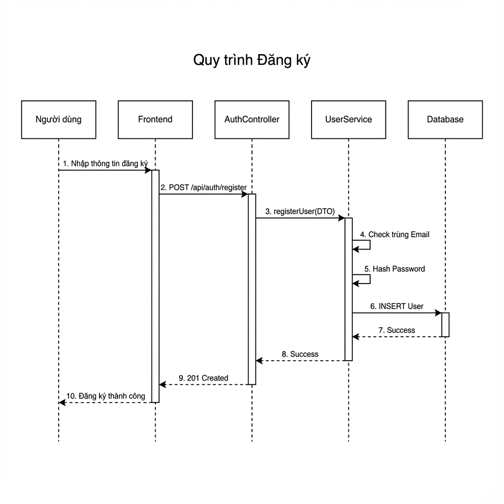

*   **Đăng nhập hệ thống (Login Flow):**

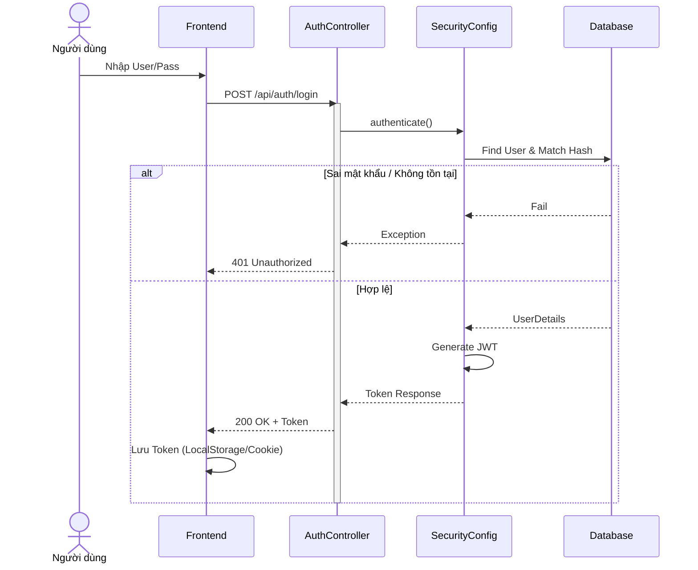
```mermaid
sequenceDiagram
    actor User as Người dùng
    participant FE as Frontend
    participant Auth as AuthController
    participant Sec as SecurityConfig
    participant DB as Database

    User->>FE: Nhập User/Pass
    FE->>Auth: POST /api/auth/login
    activate Auth
    Auth->>Sec: authenticate()
    Sec->>DB: Find User & Match Hash
    
    alt Sai mật khẩu / Không tồn tại
        DB-->>Sec: Fail
        Sec-->>Auth: Exception
        Auth-->>FE: 401 Unauthorized
    else Hợp lệ
        DB-->>Sec: UserDetails
        Sec->>Sec: Generate JWT
        Sec-->>Auth: Token Response
        Auth-->>FE: 200 OK + Token
        FE->>FE: Lưu Token (LocalStorage/Cookie)
    end
    deactivate Auth
```

**Mô tả quy trình:** Người dùng nhập tài khoản/mật khẩu → SecurityConfig xác thực với DB → Tạo JWT Token → Lưu token phía client → Chuyển hướng vào hệ thống.

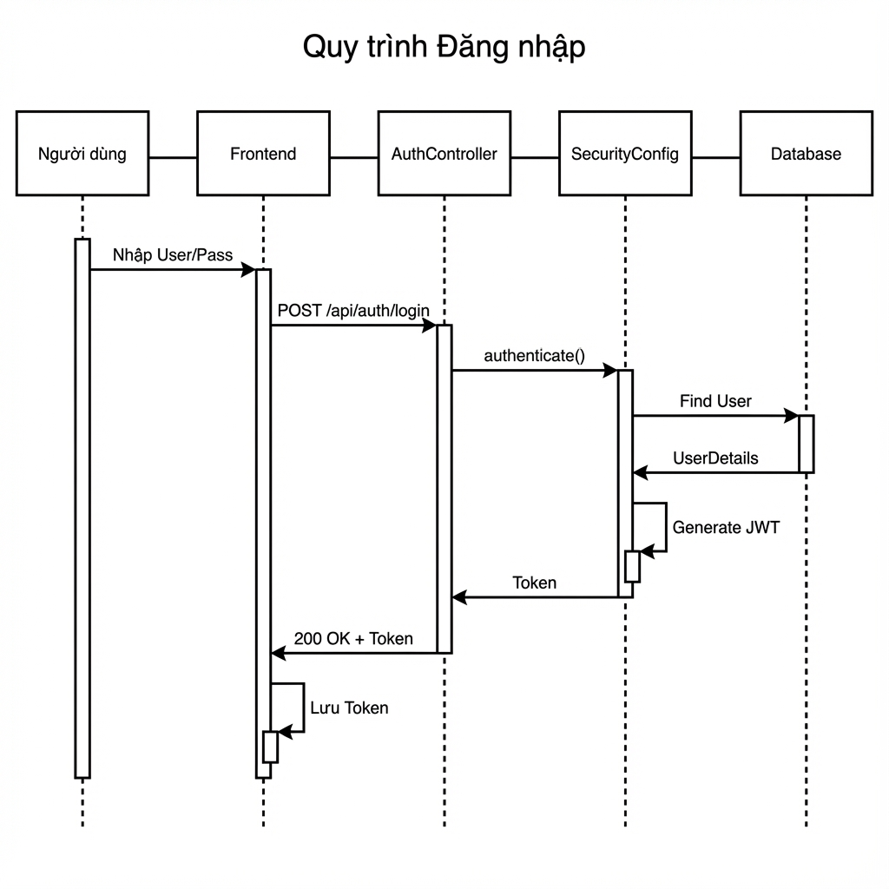

**c. Quy trình Quản lý Nội dung (Admin CRUD Flow)**
*(Mô hình chung cho quản lý Sảnh, Menu, Tin tức)*

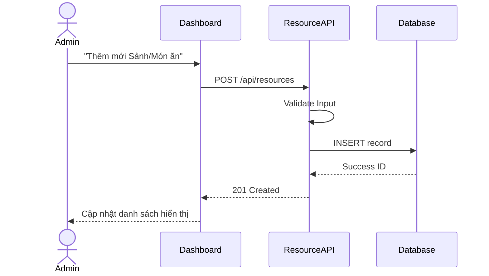
```mermaid
sequenceDiagram
    actor Admin
    participant FE as Dashboard
    participant API as ResourceAPI
    participant DB as Database

    Admin->>FE: "Thêm mới Sảnh/Món ăn"
    FE->>API: POST /api/resources
    API->>API: Validate Input
    API->>DB: INSERT record
    DB-->>API: Success ID
    API-->>FE: 201 Created
    FE-->>Admin: Cập nhật danh sách hiển thị
```

**Mô tả quy trình:** Admin nhập dữ liệu mới → API validate đầu vào → INSERT/UPDATE/DELETE vào DB → Trả về kết quả → Dashboard tự động cập nhật danh sách.

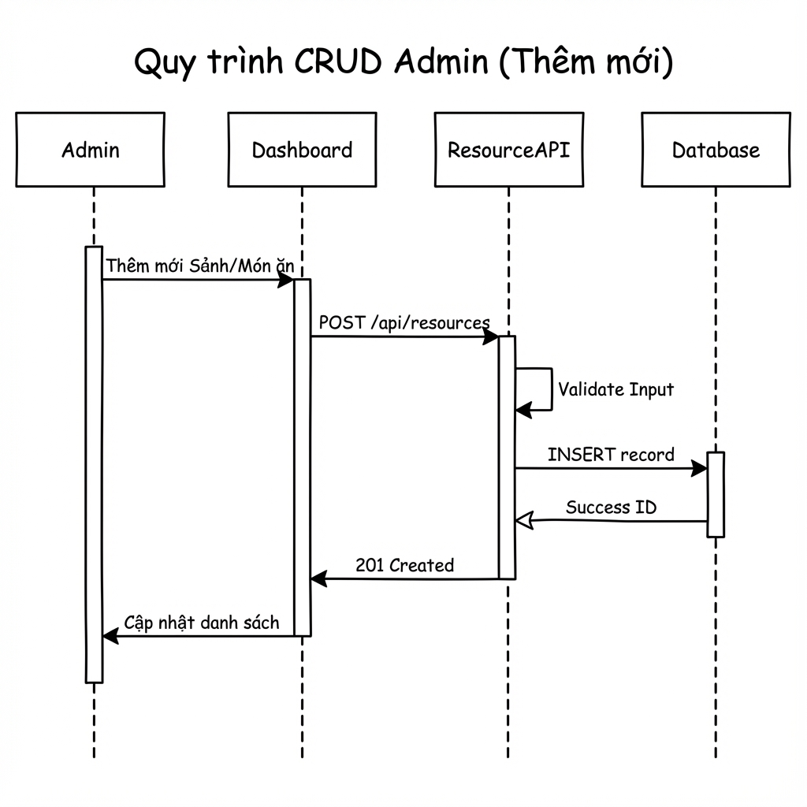

**d. Quy trình Gửi Liên hệ (Contact Flow)**

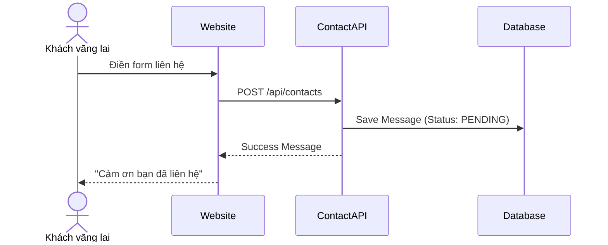
```mermaid
sequenceDiagram
    actor Guest as Khách vãng lai
    participant Web as Website
    participant API as ContactAPI
    participant DB as Database

    Guest->>Web: Điền form liên hệ
    Web->>API: POST /api/contacts
    API->>DB: Save Message (Status: PENDING)
    API-->>Web: Success Message
    Web-->>Guest: "Cảm ơn bạn đã liên hệ"
```

**Mô tả quy trình:** Khách vãng lai điền form liên hệ → API lưu message với trạng thái PENDING → Hiển thị thông báo cảm ơn → Admin sẽ xử lý sau trong Dashboard.

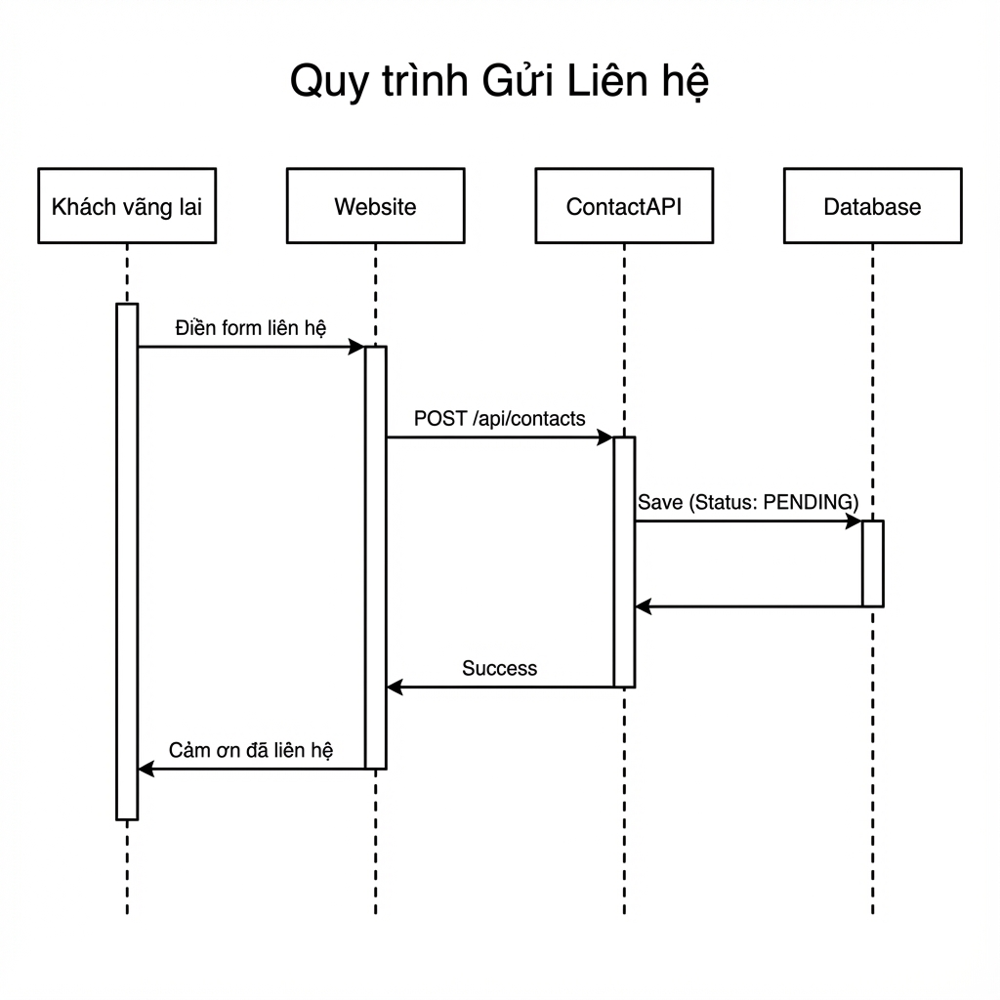

#### 2.3.6. Biểu đồ Hoạt động (Activity Diagrams) - Nghiệp vụ Chi tiết
Biểu đồ hoạt động mô tả luồng đi của dữ liệu và các điểm ra quyết định trong quy trình.

**Giải thích ký hiệu Activity Diagram:**
| Ký hiệu | Ý nghĩa |
|---------|--------|
| `([...])` | Điểm bắt đầu/kết thúc (Start/End) |
| `[...]` | Hoạt động/Hành động (Activity) |
| `{...}` | Điểm quyết định/Rẽ nhánh (Decision) |
| `[(...)]​` | Lưu trữ dữ liệu (Database) |
| `-->` | Luồng điều khiển tiếp theo |

**a. Quy trình Đăng ký (User Registration Flow)**

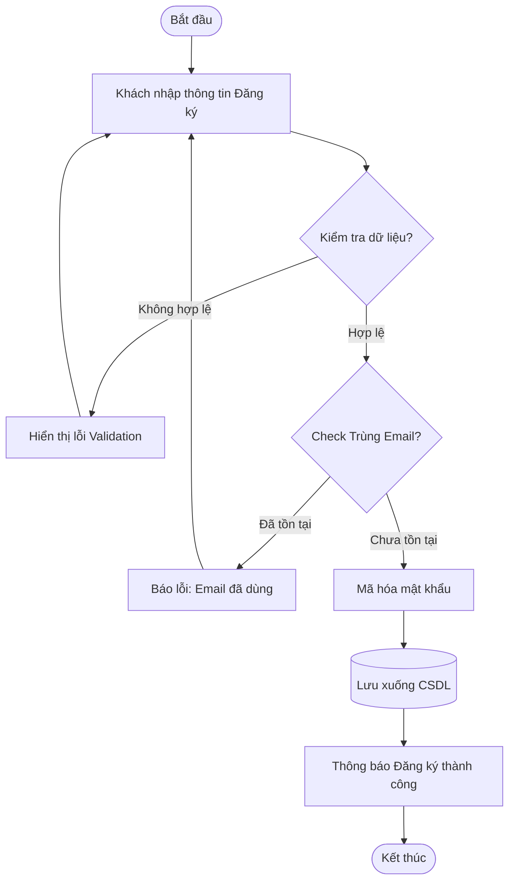
```mermaid
flowchart TD
    Start([Bắt đầu]) --> Input[Khách nhập thông tin Đăng ký]
    Input --> Valid{Kiểm tra dữ liệu?}
    Valid -- Không hợp lệ --> Error1[Hiển thị lỗi Validation]
    Error1 --> Input
    
    Valid -- Hợp lệ --> CheckExists{Check Trùng Email?}
    CheckExists -- Đã tồn tại --> Error2[Báo lỗi: Email đã dùng]
    Error2 --> Input
    
    CheckExists -- Chưa tồn tại --> Hash[Mã hóa mật khẩu]
    Hash --> SaveDB[(Lưu xuống CSDL)]
    SaveDB --> Success[Thông báo Đăng ký thành công]
    Success --> End([Kết thúc])
```

**Mô tả các bước:** Người dùng nhập thông tin → Validate format (email, password) → Kiểm tra email trùng trong DB → Mã hóa password bằng BCrypt → Lưu user mới vào CSDL.

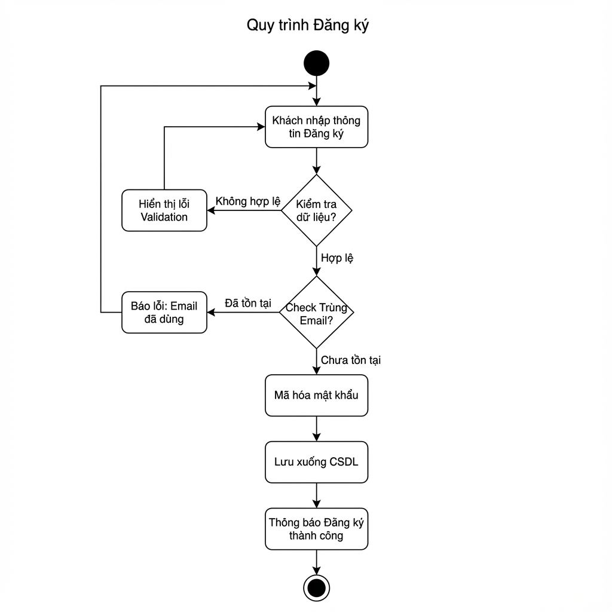

**b. Quy trình Đăng nhập (User Login Flow)**

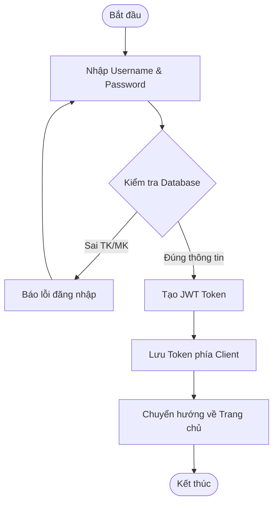
```mermaid
flowchart TD
    Start([Bắt đầu]) --> Input[Nhập Username & Password]
    Input --> CheckDB{Kiểm tra Database}
    
    CheckDB -- Sai TK/MK --> Fail[Báo lỗi đăng nhập]
    Fail --> Input
    
    CheckDB -- Đúng thông tin --> GenToken[Tạo JWT Token]
    GenToken --> SaveClient[Lưu Token phía Client]
    SaveClient --> Redirect[Chuyển hướng về Trang chủ]
    Redirect --> End([Kết thúc])
```

**Mô tả các bước:** Người dùng nhập tài khoản/mật khẩu → Hệ thống kiểm tra trong Database → Nếu đúng: Tạo JWT Token và lưu phía client → Chuyển hướng về trang chủ.

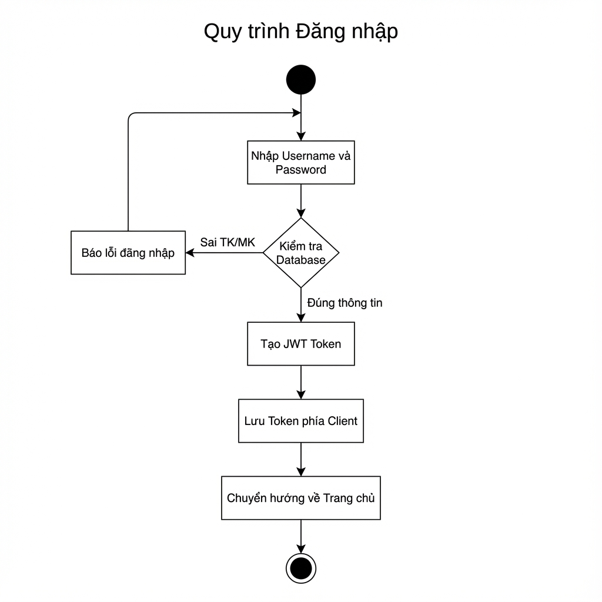

#### 2.3.7. Biểu đồ Trạng thái Booking (State Diagram)
Biểu đồ trạng thái mô tả vòng đời của một đơn đặt tiệc từ khi tạo đến khi hoàn tất:

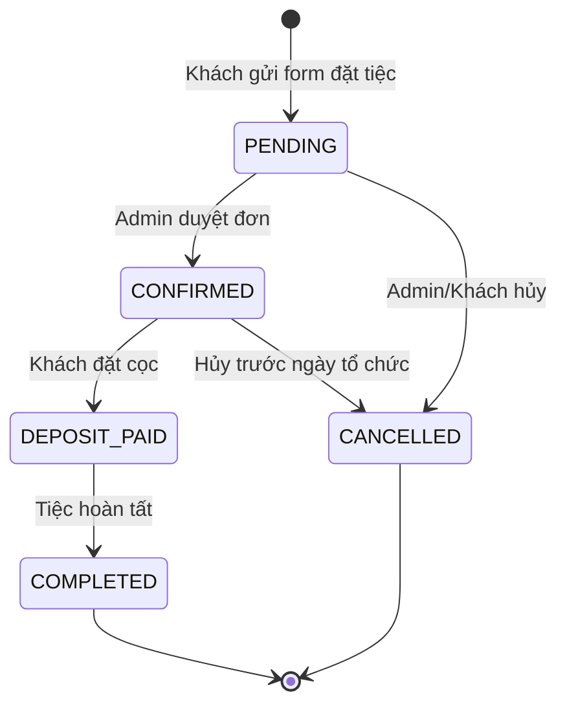
```mermaid
stateDiagram-v2
    [*] --> PENDING: Khách gửi form đặt tiệc
    PENDING --> CONFIRMED: Admin duyệt đơn
    PENDING --> CANCELLED: Admin/Khách hủy
    CONFIRMED --> DEPOSIT_PAID: Khách đặt cọc
    DEPOSIT_PAID --> COMPLETED: Tiệc hoàn tất
    CONFIRMED --> CANCELLED: Hủy trước ngày tổ chức
    COMPLETED --> [*]
    CANCELLED --> [*]
```

**Mô tả các trạng thái:**
| Trạng thái | Mô tả | Hành động tiếp theo |
|------------|-------|---------------------|
| **PENDING** | Đơn mới, chờ Admin xác nhận | Duyệt hoặc Hủy |
| **CONFIRMED** | Đã xác nhận, chờ đặt cọc | Thanh toán cọc hoặc Hủy |
| **DEPOSIT_PAID** | Đã nhận cọc, sẵn sàng tổ chức | Hoàn tất sau ngày tiệc |
| **COMPLETED** | Tiệc đã tổ chức thành công | Kết thúc |
| **CANCELLED** | Đơn bị hủy | Kết thúc |

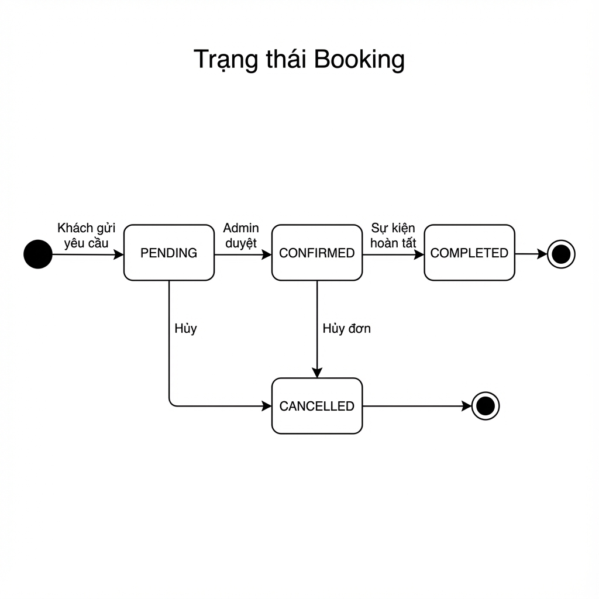

### 2.4. Tính thực tiễn & Ứng dụng thực tế
Dự án không chỉ dừng lại ở lý thuyết mà giải quyết các bài toán "đau đầu" thực tế của các trung tâm tiệc cưới hiện nay:

#### 1. Giải quyết bài toán "Quản lý thủ công"
*   **Thực trạng:** Nhiều trung tâm vẫn dùng sổ sách hoặc Excel rời rạc để lưu lịch, dễ dẫn đến tình trạng **"trùng lịch"** (double booking) hoặc sót đơn hàng.
*   **Giải pháp:** Hệ thống tự động kiểm tra sảnh trống, chặn đặt trùng lịch ngay từ khâu đăng ký, giúp ban quản lý hoàn toàn yên tâm.

#### 2. Nâng cao trải nghiệm khách hàng (Customer Experience)
*   **Thực trạng:** Khách phải đến tận nơi để xem giá, xem thực đơn.
*   **Giải pháp:** Khách hàng có thể ngồi tại nhà xem ảnh 360 độ, so sánh giá các set menu, tự ước tính chi phí cho đám cưới của mình chỉ với vài cú click.

#### 3. Tối ưu hóa vận hành & Doanh thu
*   Hệ thống báo cáo giúp người quản lý nhìn thấy ngay biểu đồ doanh thu, món ăn nào bán chạy, sảnh nào đắt khách để đưa ra chiến lược kinh doanh (khuyến mãi, giảm giá) kịp thời.

### 2.4. Thiết kế Cơ sở dữ liệu (Database Schema)
Mô hình dữ liệu quan hệ (ERD) bao gồm các thực thể chính:
*   `users`: Tài khoản quản trị viên và nhân viên.
*   `bookings`: Lưu trữ thông tin đơn đặt tiệc, thông tin khách hàng, trạng thái.
*   `halls`: Thông tin sảnh tiệc (tên, sức chứa, giá thuê, tiện ích).
*   `menus`: Thông tin món ăn, set menu.
*   `contacts`: Lưu trữ các yêu cầu liên hệ từ khách hàng.
*   `promotions` & `media_items`: Quản lý tin khuyến mãi và thư viện ảnh.

---

## 3. KẾT QUẢ TRIỂN KHAI

### 3.1. Các module đã hoàn thiện
1.  **Nền tảng hệ thống:** Đã thiết lập cấu trúc Spring Boot, kết nối MySQL, cấu hình UTF-8, tích hợp Flyway migration.
2.  **Module Booking & Contact:** Hoàn thiện luồng đặt lịch, validation dữ liệu chặt chẽ, workflow xử lý liên hệ từ khách hàng.
3.  **Module Admin Management:** Đã xây dựng hoàn chỉnh các tính năng CRUD cho Sảnh tiệc (Halls), Thực đơn (Menus), Khuyến mãi (Promotions). Dashboard hiển thị thống kê cơ bản.
4.  **API Services:** Cung cấp đầy đủ REST API cho các tác vụ quản lý và giao tiếp dữ liệu (`/api/v1/**`).

### 3.2. Trạng thái hiện tại
Các chức năng cốt lõi đã hoạt động ổn định và vượt qua các bài kiểm thử đơn vị (Unit Test) và tích hợp (Integration Test). Hệ thống sẵn sàng cho giai đoạn kiểm thử chấp nhận người dùng (UAT) và triển khai thử nghiệm.

---

## 4. HƯỚNG PHÁT TRIỂN & MỞ RỘNG
*   **Thanh toán điện tử:** Tích hợp cổng thanh toán VNPay/Momo để hỗ trợ đặt cọc online.
*   **Tương tác thời gian thực:** Tích hợp Chatbot AI để tư vấn tự động và hệ thống thông báo realtime (WebSocket).
*   **Mobile App:** Phát triển ứng dụng di động cho khách hàng theo dõi kế hoạch cưới.
*   **Công nghệ AR/VR:** Xem sảnh tiệc thực tế ảo 360 độ.

---
*Báo cáo được tổng hợp dựa trên hiện trạng project "Wedding Booking System".*
